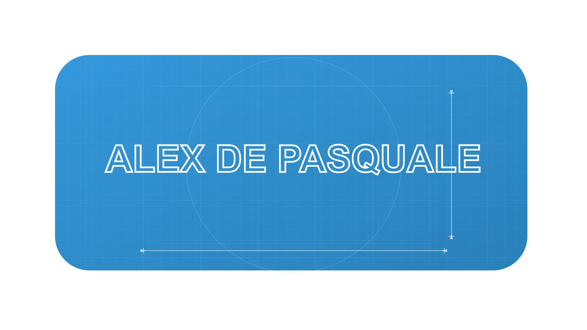

  

<h1 align="center">Hi 👋, I'm <u>Alex De Pasquale!</u></h1>

  Versatile developer with solid experience in <strong>Flutter</strong>, <strong>Python</strong>, and <strong>Java</strong>. 
  Currently diving deeper into native iOS development with <strong>Swift</strong> and web interfaces with <strong>React</strong>, always aiming to build efficient software solutions and intuitive apps.

  
  &nbsp; 

---

### 🚀 Featured Project: Race Room App

Check out my Android app, **Race Room**, developed with performance and usability in mind (available on the Google Play Store)!

 

---

### 📊 My GitHub Stats

  
  

